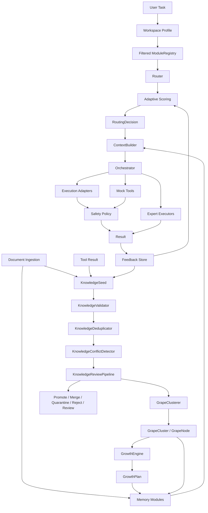

# Grona

[](https://github.com/Robotyaga/Grona/actions/workflows/tests.yml)


Grona is a lightweight research prototype for explainable sparse AI routing: instead of activating every capability for every task, it routes work through a small cluster of relevant expert modules.

The metaphor is a grape cluster. A workspace is the vineyard, expert modules are active grapes, memory sources are nutrients, routing rules decide which grapes wake up, GrowthEngine recommends future growth actions, and safety policy is the protective layer around future tool use.

## Why This Exists

Many AI systems behave like one large monolith: every request is pushed through the same broad model, prompt, memory, and tool surface. That can make behavior expensive, hard to inspect, and difficult to constrain.

Grona explores a different shape:

- describe capabilities as small modules with metadata
- route each task to a focused subset
- keep context scoped to the selected route
- preserve a visible trace of scores, reasons, context, safety decisions, growth decisions, and feedback
- validate, deduplicate, and review raw knowledge before it becomes memory, training data, or expert behavior
- group reviewed Growth Lab seeds into deterministic `GrapeCluster` and `GrapeNode` candidates
- recommend conservative growth actions from reviewed seeds and clusters without mutating the system automatically
- grow toward specialized local experts without pretending the prototype is production AI

## Current Prototype Status

Grona is currently deterministic and local-first. It does not call an LLM, execute shell commands, use external APIs, crawl files, parse PDFs, build embeddings, train models, or run real tools.

What it does today:

- routes tasks through an explainable `Router`
- stores modules in a `ModuleRegistry`
- adjusts routing with optional feedback-informed scoring
- builds route-scoped context from deterministic memory modules
- ingests in-memory demo documents into memory records
- validates raw `KnowledgeSeed` values before future promotion
- detects deterministic duplicate and potential conflict candidates between seeds
- recommends whether seeds should be promoted, merged, quarantined, rejected, or reviewed
- groups promote-candidate seeds into deterministic `GrapeCluster` and `GrapeNode` structures
- produces deterministic `GrowthDecision` and `GrowthPlan` recommendations from reviewed seeds and clusters
- recommends memory-record bridges and future expert candidates without creating them automatically
- bridges candidate grape clusters into deterministic `MemoryRecord` values
- orchestrates selected modules into structured handoffs
- runs deterministic demo expert executors and execution adapters
- evaluates planned tool actions with a safety policy
- returns deterministic mock tool results through safe adapters
- supports built-in workspace profiles for default, code, cybersecurity, media, automotive, and documents
- ships examples, tests, CI, and documentation

## Architecture Pipeline



## Feature Map

- Explainable routing with selected and skipped modules
- Adaptive feedback-informed routing
- Memory modules and context building
- Deterministic document ingestion stubs
- KnowledgeSeed, KnowledgeSource, and deterministic KnowledgeValidator
- KnowledgeSeed normalization, deduplication, potential conflict detection, and review decisions
- GrapeNode, GrapeCluster, assignment traces, and memory-record bridge helpers
- GrowthDecision, GrowthPlan, and deterministic GrowthEngine recommendations
- Orchestration and structured result handoff
- Deterministic expert execution
- Execution adapter contracts
- Safety policy layer for planned actions
- Mock tool adapters and safe mock tool runner
- Workspace profiles and lightweight project configuration
- Tests and GitHub Actions CI

## Quickstart

```bash
pip install -e .
python -m grona "Review firewall logs for suspicious port scans"
```

For tests and linting:

```bash
pip install -e .[dev]
pytest
ruff check .
```

## CLI Examples

Route a task with the default workspace:

```bash
python -m grona "Review firewall logs for suspicious port scans"
```

Use a focused workspace profile:

```bash
python -m grona "Diagnose engine overheating" --workspace automotive
python -m grona "Review this Python script for security issues" --workspace cybersecurity
python -m grona "Plan MotionCam RAW workflow" --workspace media
python -m grona "Find document indexing notes" --workspace documents
```

Run deterministic Growth Lab demos:

```bash
python -m grona --growth-demo
python -m grona --growth-review-demo
python -m grona --grape-demo
python -m grona --growth-engine-demo
```

Build context from demo memory or deterministic in-memory documents:

```bash
python -m grona "Diagnose engine overheating" --orchestrate --use-demo-memory
python -m grona "Diagnose engine overheating" --orchestrate --ingest-demo-docs
```

Run deterministic demo adapters and mock tools:

```bash
python -m grona "Review this Python script for security issues" --orchestrate --use-demo-adapters
python -m grona "Review this project for security issues" --orchestrate --use-demo-adapters --safe
python -m grona "Review this project" --use-demo-adapters --dry-run-tools
python -m grona "Analyze engine overheating symptoms" --use-demo-tools
```

`--execute-demo-experts`, `--use-demo-adapters`, and `--use-demo-tools` imply orchestration if `--orchestrate` is omitted. Some workspace profiles also imply orchestration or safety by default.

## Demo Scripts

```bash
python examples/basic_routing_demo.py
python examples/feedback_demo.py
python examples/adaptive_routing_demo.py
python examples/orchestration_demo.py
python examples/memory_demo.py
python examples/expert_execution_demo.py
python examples/execution_adapters_demo.py
python examples/safety_policy_demo.py
python examples/tool_adapter_demo.py
python examples/document_ingestion_demo.py
python examples/workspace_profile_demo.py
python examples/knowledge_seed_demo.py
python examples/knowledge_review_demo.py
python examples/grape_cluster_demo.py
python examples/growth_engine_demo.py
```

## Documentation

- [Architecture](docs/architecture.md)
- [Growth Lab](docs/growth-lab.md)
- [Development notes](docs/development.md)
- [Workspace profiles](docs/workspaces.md)
- [Research notes](docs/research-notes.md)
- [Project vision](docs/project-vision.md)
- [Roadmap](docs/roadmap.md)
- [v0.1.0 prototype release notes](docs/release-notes-v0.1.0-prototype.md)
- [Contributing](CONTRIBUTING.md)
- [Security](SECURITY.md)
- [Changelog](CHANGELOG.md)

## Roadmap Toward Growth Lab

Growth Lab is a controlled environment for experimenting with how modular AI systems can grow from structured knowledge, feedback, donor model outputs, validation loops, and local tools.

Current Growth Lab foundation:

- `KnowledgeSource`: source type, name, reliability, metadata
- `KnowledgeSeed`: raw knowledge candidate with domains, keywords, confidence, and status
- `KnowledgeValidator`: deterministic scoring, warnings, and validation status
- `KnowledgeDeduplicator`: deterministic exact and near duplicate checks
- `KnowledgeConflictDetector`: conservative potential conflict markers
- `KnowledgeReviewPipeline`: review decisions before future promotion or clustering
- `GrapeNode`: a small organized unit created from one reviewed seed
- `GrapeCluster`: deterministic group of related grape nodes in one primary domain
- `GrapeAssignment`: trace of seed-to-cluster assignment decisions
- `GrowthDecision`: one explainable recommended growth action
- `GrowthPlan`: a deterministic bundle of growth recommendations
- `GrowthEngine`: conservative recommendations from reviewed seeds, clusters, and assignments
- conversions from document chunks and mock tool results into raw seeds
- conversion from grape clusters and growth plans into memory records

Planned concepts include:

- `BenchmarkSuite`: repeatable tests for routing and expert behavior
- `DonorModelAdapter` and `LMStudioAdapter`: future optional model interfaces
- `TrainingDataExporter`: future export of validated traces for specialized experts

See [Growth Lab](docs/growth-lab.md), [Project vision](docs/project-vision.md), and [Roadmap](docs/roadmap.md) for the longer version.

## Current Limitations

- This is a prototype, not a production assistant.
- GrowthEngine recommends actions only; it does not mutate modules, memory, clusters, or models automatically.
- No autonomous self-training, model weights, training-data export, or automatic expert creation yet.
- No real LLM integration yet.
- No real donor model integration yet.
- No real tool execution, shell execution, subprocesses, filesystem tools, or network tools.
- No real sandboxing or process isolation.
- No external APIs, OpenAI API, Ollama integration, web server, vector database, or SQL database.
- Document ingestion is deterministic in-memory text only.
- KnowledgeSeed validation and review are deterministic heuristics, not web fact-checking or truth verification.
- GrapeCluster creation is deterministic keyword/domain grouping, not semantic clustering or training.
- GrowthEngine decisions are deterministic recommendations, not automatic truth resolution.
- Conflict detection marks potential conflicts only; it does not resolve factual truth.
- No PDF parsing, OCR, semantic embeddings, vector search, or filesystem crawler.
- Workspace profiles are built-in/in-memory only; no persisted workspace directory or external config loader exists yet.
- Safety policy is planning/policy evaluation only, not a security boundary.

These limits are intentional. Grona is a public research/prototype foundation for sparse modular AI architecture, not a production claim.
