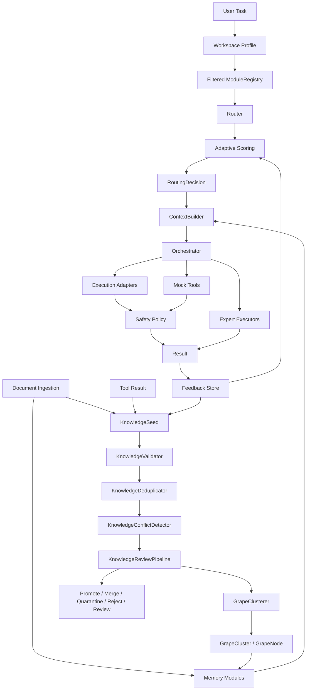

# Architecture

Grona is a modular sparse AI architecture prototype. Its core design goal is to route each task to the smallest useful set of modules instead of activating every model, memory region, tool, and context source for every request.

This document describes the current deterministic prototype, not a production AI system.

## Documentation Map

- [Project vision](project-vision.md)
- [Growth Lab](growth-lab.md)
- [Workspace profiles](workspaces.md)
- [Development notes](development.md)
- [Research notes](research-notes.md)
- [Roadmap](roadmap.md)
- [v0.1.0 prototype release notes](release-notes-v0.1.0-prototype.md)

## System Diagram

## Current Request Lifecycle

1. CLI or caller selects a `WorkspaceProfile`.
2. Grona filters the `ModuleRegistry` for the workspace.
3. Raw demo document text may be converted into memory records.
4. Document chunks, tool results, feedback, or notes may be represented as raw `KnowledgeSeed` values.
5. `KnowledgeValidator` scores seeds as validated, weak, quarantined, or rejected.
6. `KnowledgeDeduplicator` marks exact or deterministic near duplicates as merge candidates.
7. `KnowledgeConflictDetector` marks conservative potential conflicts without resolving truth.
8. `KnowledgeReviewPipeline` recommends promote, merge, quarantine, reject, or review decisions.
9. `GrapeClusterer` can group promote-candidate seeds into deterministic cluster candidates.
10. Grape clusters can be bridged into deterministic `MemoryRecord` values for context demos.
11. A user task enters the system.
12. `Router` selects relevant modules from the workspace registry.
13. Adaptive routing may adjust scores from feedback history.
14. `ContextBuilder` prepares stub and memory context for selected modules.
15. `Orchestrator` can hand off, run deterministic experts, or use deterministic adapters.
16. If safety is enabled, adapter or mock-tool actions are planned and evaluated.
17. `OrchestrationResult` collects route decisions, context, expert results, tool summaries, and safety metadata.
18. Feedback can be written later and used to influence future adaptive routing.

## Workspace Layer

A workspace is a configured vineyard for one use case.

- `WorkspaceProfile` describes enabled modules, domains, memory sources, tool profiles, routing mode, adaptive defaults, safety defaults, and metadata.
- `WorkspaceConfig` wraps a profile with optional routing, context, safety, memory, tool, and metadata settings.
- `filter_modules_for_workspace()` returns a filtered registry without mutating the original registry.

Profiles affect routing by narrowing the module registry before `Router` scores modules. If a profile filters modules, Grona preserves `general-reasoning` as a fallback when available.

This is not production config management. No workspace directories, disk-loaded config files, secrets, or external config services are implemented.

## Growth Lab Seed and Cluster Layers

Growth Lab begins with raw knowledge candidates, not trusted memory.

- `KnowledgeSource` describes where a seed came from and how reliable that source is.
- `KnowledgeSeed` stores raw content, domains, keywords, confidence, status, source, and metadata.
- `ValidationResult` records accepted status, score, reasons, warnings, and metadata.
- `KnowledgeValidator` applies deterministic checks without web fact-checking or model calls.
- `NormalizedKnowledge` provides a deterministic normalized view for matching.
- `KnowledgeDeduplicator` marks exact and simple near duplicates as merge candidates.
- `KnowledgeConflictDetector` marks potential conflicts from conservative polarity patterns.
- `KnowledgeReviewPipeline` combines checks into `SeedReviewDecision` recommendations.
- `GrapeNode` represents one organized candidate node from a reviewed seed.
- `GrapeCluster` groups related grape nodes inside one primary domain.
- `GrapeAssignment` keeps an explicit assignment or skip trace.
- `GrapeClusterer` performs deterministic domain and keyword-overlap grouping.

The current seed layer can convert existing `DocumentChunk` values and mock `ToolResult` values into seeds. That connects existing ingestion and tool contracts to future growth experiments without automatically promoting raw data.

The current cluster layer only groups promote-candidate seeds. It does not create experts, mutate routing, train models, perform semantic clustering, or persist clusters.

## Router and Registry

`ExpertModule` is routing metadata: name, domain, capabilities, keywords, cost, and demo handler. `ModuleRegistry` stores available modules. `Router` scores modules using deterministic keyword/domain signals, then returns a `RoutingDecision` with selected modules, skipped modules, scores, and reasons.

Adaptive routing is opt-in or workspace-enabled. It applies small bounded adjustments from prior `FeedbackRecord` values. It is not neural learning.

## Document Ingestion Stub

The document ingestion stub prepares future local document workflows without adding real RAG infrastructure.

- `DocumentSource` stores in-memory raw text with an id, title, source type, content, and metadata.
- `DocumentChunk` stores a deterministic chunk with source id, content, index, extracted keywords, assigned domains, and metadata.
- `TextChunker` splits normalized text into max-character chunks with overlap and practical word-boundary handling.
- `DocumentIngestor` converts sources into chunks, chunks into `MemoryRecord` values, and sources into an `InMemoryKeywordMemory` module.

This is not a filesystem crawler, PDF parser, OCR pipeline, embedding model, or vector database. It is deterministic text-to-memory preparation.

## Memory Modules and ContextBuilder

`MemoryRecord` stores small knowledge items with domains, keywords, source, and metadata. `InMemoryKeywordMemory` searches these records by deterministic keyword/domain overlap.

`ContextBuilder` combines route-specific stub context with memory context from relevant memory modules. Ingested document chunks and grape-cluster memory records flow through the same context path as other deterministic memory.

## Execution, Tools, and Safety

`ExecutableExpert` is the direct execution contract. `ExecutionAdapter` bridges a selected expert module to a concrete execution backend. `ToolAdapter` models future tool use without performing it.

The safety layer evaluates planned actions before any future adapter can run a real tool:

- `ToolAction`
- `PolicyDecision`
- `SafetyPolicy`
- `ExecutionPlan`
- `SafeExecutionAdapter`
- `SafeToolRunner`

This is not a real sandbox. It does not isolate processes, execute commands, run subprocesses, scan networks, read files, write files, or call external APIs.

## Grape-Cluster Metaphor

- Workspace is the vineyard/environment.
- Profile is how the cluster is arranged for a specific use case.
- Enabled modules are active grapes.
- Knowledge seeds are raw nutrients that still need validation and review.
- Grape nodes are organized candidate nutrients after review.
- Grape clusters are deterministic groupings of related candidate nodes.
- Memory sources are knowledge nutrients that have entered the context path.
- Safety policy is the protective layer.
- Routing config is the growth/activation rule set.
- Feedback is the trace of which routes worked.

## Prototype Boundaries

The current prototype is intentionally deterministic. It provides inspectable contracts for routing, memory, seed validation, seed review, grape cluster candidates, orchestration, execution adapters, mock tools, workspaces, and safety policy. It does not provide real LLM generation, real tool execution, sandboxing, persistent knowledge stores, semantic search, web fact-checking, training, automatic truth resolution, automatic expert growth, or production configuration management.
