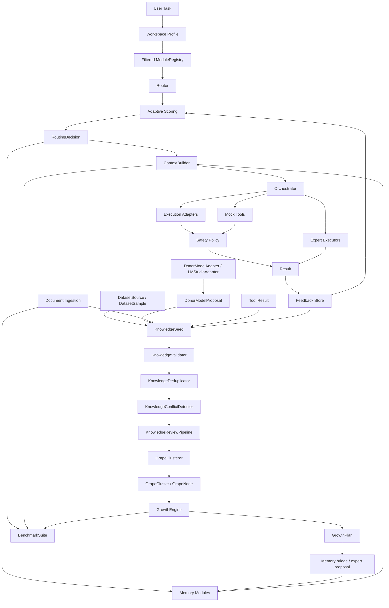

# Architecture

Grona is a modular sparse AI architecture prototype. Its core design goal is to route each task to the smallest useful set of modules instead of activating every model, memory region, tool, and context source for every request.

This document describes the current deterministic prototype, not a production AI system.

## Documentation Map

- [Project vision](project-vision.md)
- [Growth Lab](growth-lab.md)
- [Dataset ingestion](dataset-ingestion.md)
- [Benchmarking](benchmarking.md)
- [Workspace profiles](workspaces.md)
- [Development notes](development.md)
- [Research notes](research-notes.md)
- [Roadmap](roadmap.md)
- [v0.1.0 prototype release notes](release-notes-v0.1.0-prototype.md)

## System Diagram

## Current Request Lifecycle

1. A caller selects a `WorkspaceProfile`.
2. Grona filters the `ModuleRegistry` for that workspace.
3. Raw demo documents, dataset samples, donor proposals, tool results, feedback, or notes may become raw `KnowledgeSeed` values.
4. Growth Lab validates, reviews, clusters, and plans deterministic growth recommendations.
5. A user task enters the router.
6. `Router` selects relevant modules and records skipped modules, scores, and reasons.
7. `ContextBuilder` prepares deterministic stub and memory context.
8. `Orchestrator` can hand off, run deterministic experts, or use deterministic adapters.
9. Safety policy can evaluate planned adapter or mock-tool actions.
10. `BenchmarkSuite` can run small deterministic cases against baseline or enhanced configurations.

## Main Layers

- Workspace profiles: constrain active domains, modules, and defaults.
- Router and registry: score modules by deterministic domain, capability, and keyword overlap.
- Memory and context: retrieve local route-scoped context from deterministic memory modules.
- Document ingestion: convert in-memory text into chunks and memory records.
- Dataset ingestion: normalize tiny structured samples and preserve provenance/license metadata.
- Donor adapters: collect untrusted proposals from deterministic static or explicit local-model adapters.
- Growth Lab: validate, deduplicate, review, cluster, and plan growth from raw seeds.
- Execution: provide deterministic executors, adapters, mock tools, and safety planning.
- BenchmarkSuite: run deterministic benchmark cases and report routing, context, growth, and overall scores.

## Donor Proposal Layer

`DonorModelProposal` stores untrusted proposal output with task, source, proposal type, content, confidence, and metadata. `StaticDonorModelAdapter` is deterministic and offline for tests and demos. `LMStudioAdapter` is an optional local adapter foundation that uses standard-library HTTP only when explicitly configured by a caller.

`DonorProposalCollector` collects successful proposals and records adapter errors separately. A `knowledge_seed` proposal can become a raw `KnowledgeSeed` through `knowledge_seed_from_donor_proposal()`, but this does not bypass validation, review, benchmarking, or human judgment.

The donor layer is not answer generation, autonomous learning, training, or a trusted model authority.

## Benchmark Layer

`BenchmarkCase` defines a task with expected domains, modules, and keywords. `BenchmarkRunConfig` enables deterministic features such as demo memory, dataset seeds, grape clusters, GrowthEngine, and orchestration. `BenchmarkSuite` returns a `BenchmarkReport` containing per-case `BenchmarkResult` scores.

This layer measures trace quality, not model intelligence. It does not call LLMs, use external judge models, download benchmark datasets, train models, use embeddings, or claim real accuracy.

## Prototype Boundaries

The current prototype provides inspectable contracts for routing, dataset ingestion, donor proposals, memory, seed validation, seed review, grape cluster candidates, GrowthEngine recommendations, benchmarking, orchestration, execution adapters, mock tools, workspaces, and safety policy. It does not provide default LLM calls, real LLM generation, real dataset downloads, real tool execution, sandboxing, persistent knowledge stores, semantic search, web fact-checking, training, automatic truth resolution, automatic expert growth, or production configuration management.
