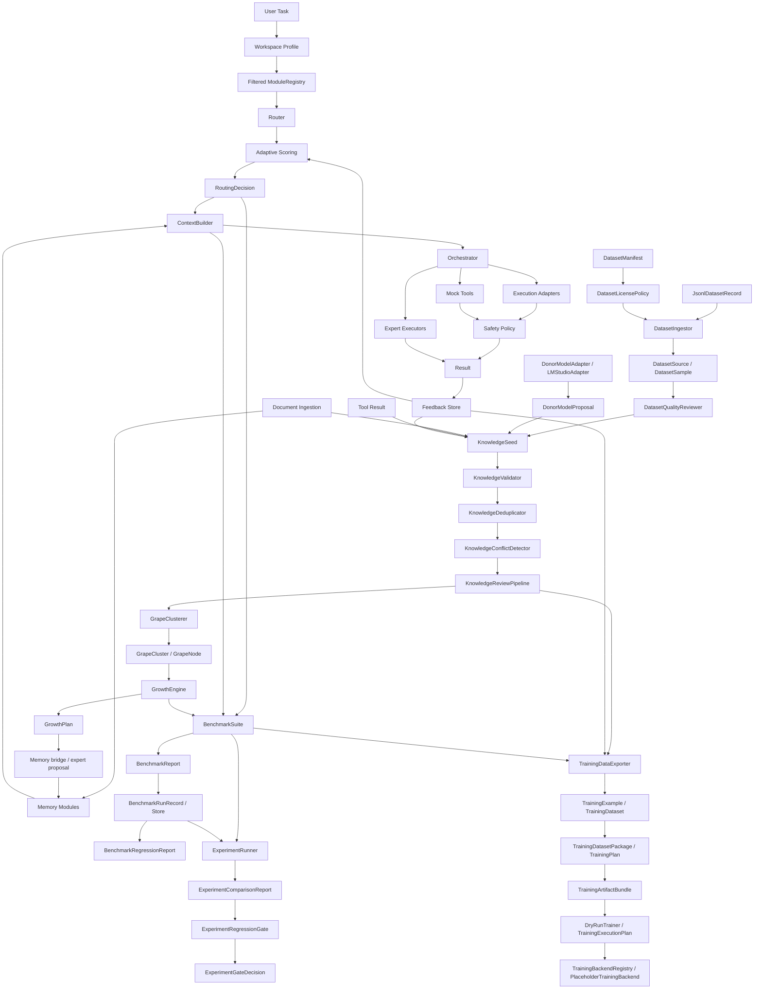

# Architecture

Grona is a modular sparse AI architecture prototype. Its core design goal is to route each task to the smallest useful set of modules instead of activating every model, memory region, tool, and context source for every request.

This document describes the current deterministic prototype, not a production AI system.

## Documentation Map

- [Project vision](project-vision.md)
- [Growth Lab](growth-lab.md)
- [Dataset ingestion](dataset-ingestion.md)
- [Benchmarking](benchmarking.md)
- [Dry-run trainer interface](training-dry-run.md)
- [Optional training backend boundary](training-backends.md)
- [Workspace profiles](workspaces.md)
- [Development notes](development.md)
- [Research notes](research-notes.md)
- [Roadmap](roadmap.md)
- [v0.1.0 prototype release notes](release-notes-v0.1.0-prototype.md)

## System Diagram



## Current Request Lifecycle

1. A caller selects a `WorkspaceProfile`.
2. Grona filters the `ModuleRegistry` for that workspace.
3. Raw demo documents, dataset samples, donor proposals, tool results, feedback, or notes may become raw `KnowledgeSeed` values.
4. Dataset rows can pass through `DatasetManifest`, `DatasetLicensePolicy`, and `DatasetIngestor` before becoming `DatasetSample` values.
5. `DatasetQualityReviewer` can filter normalized samples before accepted reviewed samples become raw `KnowledgeSeed` candidates.
6. Growth Lab validates, reviews, clusters, and plans deterministic growth recommendations.
7. A user task enters the router.
8. `Router` selects relevant modules and records skipped modules, scores, and reasons.
9. `ContextBuilder` prepares deterministic stub and memory context.
10. `Orchestrator` can hand off, run deterministic experts, or use deterministic adapters.
11. Safety policy can evaluate planned adapter or mock-tool actions.
12. `BenchmarkSuite` can run small deterministic cases against baseline or enhanced configurations.
13. `BenchmarkRunRecord` can preserve a `BenchmarkReport` snapshot.
14. `compare_benchmark_runs()` can compare two snapshots and produce a regression report.
15. `ExperimentRunner` can compare multiple deterministic configs and a monolith stub in one report.
16. `ExperimentRegressionGate` can turn experiment deltas into a warning or strict threshold decision.
17. `TrainingDataExporter` can prepare reviewed or validated traces as explicit in-memory training example candidates.
18. `TrainingDatasetPackage`, `TrainingPlan`, `TrainingArtifactBundle`, and `DryRunTrainer` can preview training readiness without training or executing commands.
19. `TrainingBackendRegistry` and `PlaceholderTrainingBackend` can declare future optional backend capabilities, static dependency blockers, and dry-run plan boundaries.

## Main Layers

- Workspace profiles: constrain active domains, modules, and defaults.
- Router and registry: score modules by deterministic domain, capability, and keyword overlap.
- Memory and context: retrieve local route-scoped context from deterministic memory modules.
- Document ingestion: convert in-memory text into chunks and memory records.
- Dataset manifest ingestion: parse tiny JSONL records, apply license policy, and preserve provenance.
- Dataset quality review: deterministically filter normalized samples before seed or export use.
- Dataset sample ingestion: normalize tiny structured samples and preserve provenance/license metadata.
- Donor adapters: collect untrusted proposals from deterministic static or explicit local-model adapters.
- Growth Lab: validate, deduplicate, review, cluster, and plan growth from raw seeds.
- Execution: provide deterministic executors, adapters, mock tools, and safety planning.
- BenchmarkSuite: run deterministic benchmark cases and report routing, context, growth, and overall scores.
- Benchmark snapshots: persist report records and compare baseline/candidate score deltas.
- Experiment runner: run multiple deterministic configs and compare them against a baseline config.
- Experiment regression gate: classify comparison regressions with explicit thresholds.
- Training export: prepare conservative training example candidates while preserving provenance and validation metadata.
- Training dry-run: validate training plan plus artifact bundle readiness and produce placeholder command previews without execution.
- Training backend boundary: register optional placeholder backends, expose capability lookup, and report static dependency blockers without execution.

## Experiment Layer

The experiment layer is deliberately a harness over existing benchmark contracts:

```text
ExperimentConfig -> ExperimentRunner -> ExperimentResult -> ExperimentComparisonReport
ExperimentComparisonReport -> ExperimentRegressionGate -> ExperimentGateDecision
```

`ExperimentConfig` names one deterministic mode: `routing_only`, `orchestrated_context`, `memory_context`, `growth_trace`, or `monolith_stub`.

`ExperimentRunner` reuses `BenchmarkSuite` for Grona configs and wraps every report in a `BenchmarkRunRecord`. It reuses benchmark regression helpers to compute deltas against the baseline config.

`MonolithBaseline` is only a deterministic stub. It simulates weak broad coverage without explicit module trace, real context routing, GrowthEngine traces, LM Studio, model calls, external APIs, downloads, or training.

`ExperimentComparisonReport` summarizes per-config scores, deltas, best config, improved/regressed configs, and per-case score comparison. It is not a real Grona-vs-monolith proof.

`ExperimentRegressionGate` evaluates the comparison with explicit overall, routing, context, growth, and per-case thresholds. It is warning-only by default and exists to prepare future CI checks without making benchmark scores a hard blocker before calibration.

## Benchmark Snapshot Layer

The benchmark snapshot layer is deliberately separate from scoring:

```text
BenchmarkReport -> BenchmarkRunRecord -> BenchmarkRunStore -> BenchmarkRegressionReport
```

`BenchmarkRunRecord` stores run id, creation time, config name, optional git commit, report data, metadata, and schema version.

`InMemoryBenchmarkRunStore` supports deterministic tests and demos. `JsonlBenchmarkRunStore` appends explicit JSONL snapshots only when the caller provides a file path.

`BenchmarkRegressionReport` compares average and per-case score deltas. It classifies cases as improved, regressed, or unchanged using a deterministic threshold. This is not LLM judging, statistical analysis, or real model accuracy evaluation.

## Dataset Manifest And Review Layer

`DatasetManifest` describes where a dataset source came from, its format, license, allowed uses, domains, capabilities, review policy, and metadata. `DatasetLicensePolicy` answers whether the manifest can be used for knowledge seed candidates or training export candidates and explains why.

`JsonlDatasetRecord` preserves parsed JSONL row data with line numbers. `DatasetIngestor` applies policy, normalizes Alpaca-like, ShareGPT-like, or generic text rows, and returns a `DatasetIngestionReport` counts and rejection reasons.

`DatasetQualityReviewer` then applies deterministic quality checks to normalized samples. It can reject empty samples, too-short samples, duplicates, license-blocked samples, unsupported samples, missing answers, and suspicious prompt-marker rows. It can also mark borderline samples as `needs_human_review` instead of accepting them.

Accepted reviewed samples can become raw `KnowledgeSeed` candidates with review metadata preserved. This does not bypass later `KnowledgeValidator`, `KnowledgeReviewPipeline`, benchmark checks, or human judgment.

This layer does not download datasets, call Hugging Face, add `datasets`, parse Parquet, stream large corpora, use embeddings, run semantic deduplication, call LLM judges, train models, or promote rows into durable knowledge.

## Donor Proposal Layer

`DonorModelProposal` stores untrusted proposal output with task, source, proposal type, content, confidence, and metadata. `StaticDonorModelAdapter` is deterministic and offline for tests and demos. `LMStudioAdapter` is an optional local adapter foundation that uses standard-library HTTP only when explicitly configured by a caller.

`DonorProposalCollector` collects successful proposals and records adapter errors separately. A `knowledge_seed` proposal can become a raw `KnowledgeSeed` through `knowledge_seed_from_donor_proposal()`, but this does not bypass validation, review, benchmarking, or human judgment.

The donor layer is not answer generation, autonomous learning, training, or a trusted model authority.

## Training Export Layer

`TrainingExample` stores explicit candidate training data with instruction, input, output, source, domains, capabilities, provenance, license, validation status, and metadata. `TrainingDataset` keeps examples in deterministic order and can summarize domains, sources, and validation statuses.

`TrainingDataExporter` builds examples from safe internal records such as validated `KnowledgeSeed` values, accepted review decisions, positive feedback records, and synthetic benchmark traces. It does not write files by default, train models, call LLMs, download datasets, or guarantee that exported examples are useful for real training.

`TrainingDatasetPackage`, `TrainingPlan`, and `TrainingArtifactBundle` then make split, config, manifest, card, and artifact boundaries explicit. `DryRunTrainer` consumes those in-memory objects to produce a readiness report and placeholder `TrainingExecutionPlan`. It does not execute the preview, spawn subprocesses, call shells, or train models.

`TrainingBackendRegistry` and `PlaceholderTrainingBackend` add an optional backend boundary after dry-run planning. They declare capabilities, supported adapter types, required artifacts, and static dependency blockers without plugin auto-discovery, package imports, shell commands, or training execution.

## Benchmark Layer

`BenchmarkCase` defines a task with expected domains, modules, and keywords. `BenchmarkRunConfig` enables deterministic features such as demo memory, dataset seeds, grape clusters, GrowthEngine, and orchestration. `BenchmarkSuite` returns a `BenchmarkReport` containing per-case `BenchmarkResult` scores.

This layer measures trace quality, not model intelligence. It does not call LLMs, use external judge models, download benchmark datasets, train models, use embeddings, or claim real accuracy.

## Prototype Boundaries

The current prototype provides inspectable contracts for routing, dataset manifest ingestion, dataset quality review, donor proposals, memory, seed validation, seed review, grape cluster candidates, GrowthEngine recommendations, benchmarking, benchmark snapshots, experiment comparisons, experiment gate reports, training export, training packaging, artifact bundling, dry-run training previews, optional training backend boundaries, orchestration, execution adapters, mock tools, workspaces, and safety policy. It does not provide default LLM calls, real LLM generation, real dataset downloads, real tool execution, sandboxing, persistent knowledge stores, semantic search, web fact-checking, model training, automatic truth resolution, automatic expert growth, or production configuration management.
